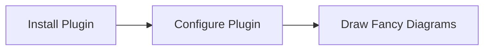
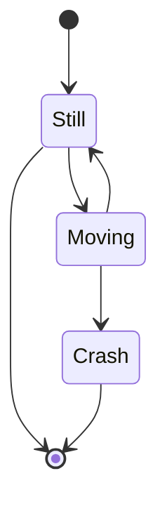
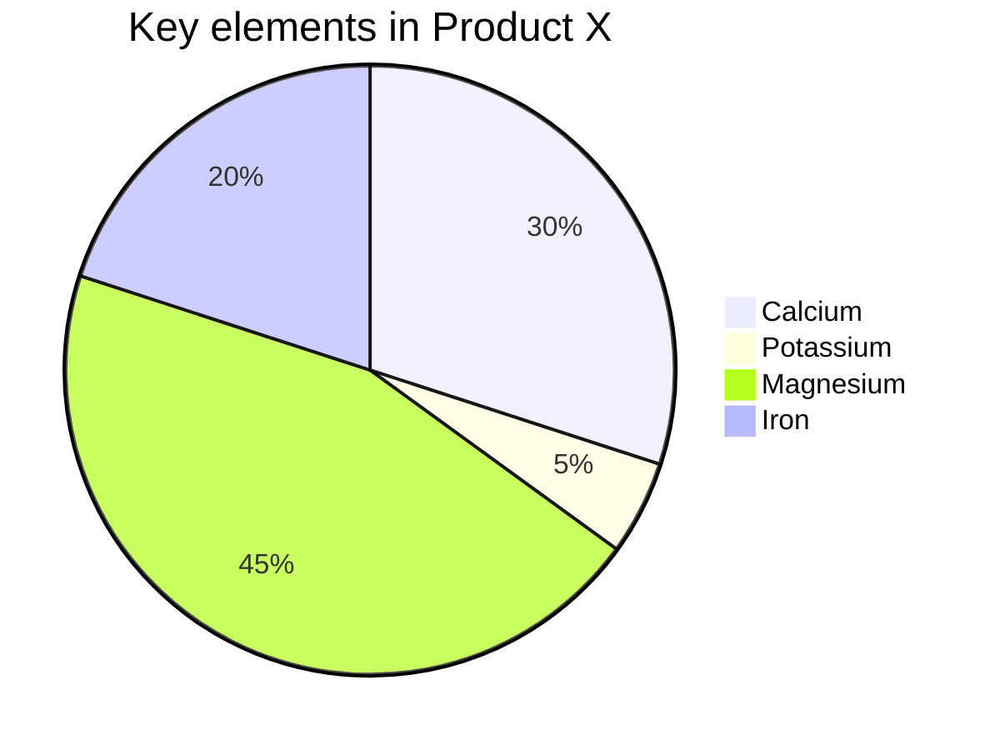

These are examples of creating diagrams using [Mermaid][] syntax.

## Diagrams

```mermaid
graph LR
install[Install Plugin]
install --> configure[Configure Plugin]
configure --> draw[Draw Fancy Diagrams]
```

### State diagram

```mermaid
stateDiagram
    [*] --> Still
    Still --> [*]

    Still --> Moving
    Moving --> Still
    Moving --> Crash
    Crash --> [*]
```

## Charts

### Pie

```mermaid
pie
    title Key elements in Product X
    "Calcium" : 30
    "Potassium" : 5
    "Magnesium" : 45
    "Iron" :  20
```

[mermaid]: http://mermaid-js.github.io/mermaid/#/
